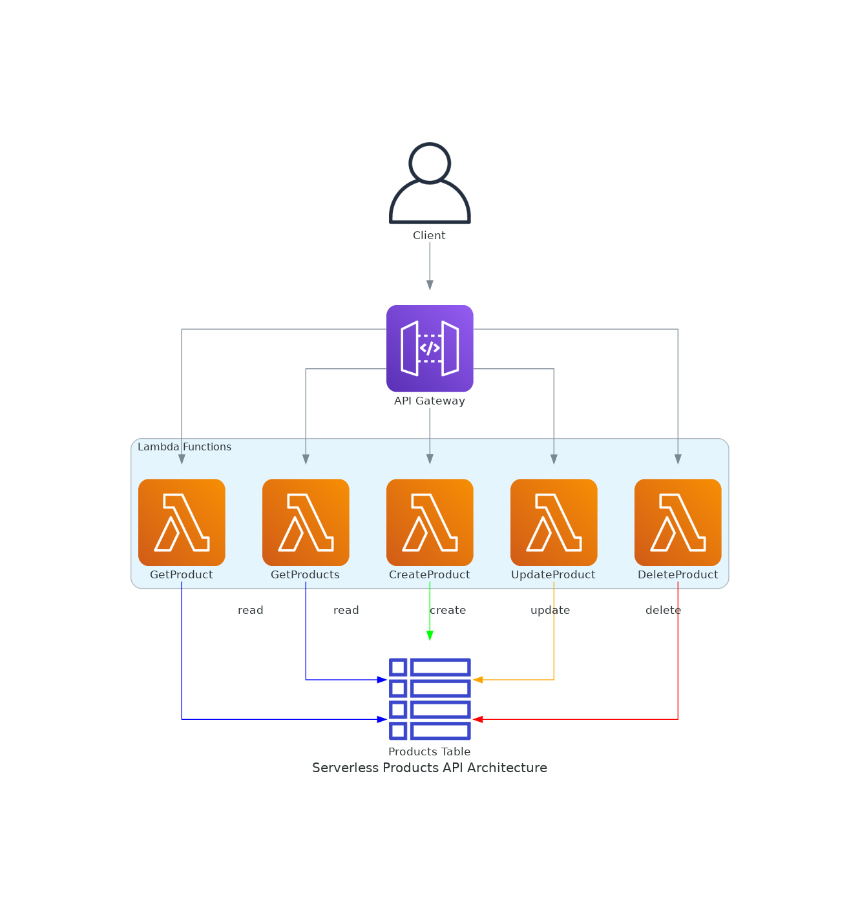

# Serverless API con API Gateway, Lambda y DynamoDB

Este repositorio contiene una implementación completa de una API REST serverless utilizando servicios de AWS:
- Amazon API Gateway
- AWS Lambda
- Amazon DynamoDB

La aplicación es una API de gestión de productos que permite crear, leer, actualizar y eliminar (CRUD) productos en una base de datos DynamoDB.



## Características

- Arquitectura completamente serverless
- Operaciones CRUD completas 
- Modelo de costos optimizado (pago por uso)
- Manejo de errores robusto
- Seguridad mediante IAM
- Manejo de CORS para acceso desde aplicaciones web
- Infraestructura como código mediante AWS SAM/CloudFormation

## Requisitos previos

Para implementar esta solución, necesitarás:

- [AWS CLI](https://aws.amazon.com/cli/) instalado y configurado
- [AWS SAM CLI](https://docs.aws.amazon.com/serverless-application-model/latest/developerguide/serverless-sam-cli-install.html) instalado
- [Node.js](https://nodejs.org/) (v14.x o superior)
- Una cuenta de AWS con permisos adecuados

## Estructura del proyecto

```
.
├── src/                  # Código fuente de las funciones Lambda
│   ├── getProduct.js     # Función para obtener un producto por ID
│   ├── getProducts.js    # Función para listar todos los productos
│   ├── createProduct.js  # Función para crear un nuevo producto
│   ├── updateProduct.js  # Función para actualizar un producto existente
│   └── deleteProduct.js  # Función para eliminar un producto
├── template.yaml         # Plantilla SAM/CloudFormation
├── package.json          # Dependencias del proyecto
└── README.md             # Este archivo
```

## Implementación

1. Clona este repositorio:
   ```bash
   git clone https://github.com/gabanox/serverless-aws-products-api.git
   cd serverless-aws-products-api
   ```

2. Instala las dependencias:
   ```bash
   npm install
   ```

3. Despliega la aplicación usando SAM CLI:
   ```bash
   sam build
   sam deploy --guided
   ```

   Durante el despliegue guiado, SAM CLI te pedirá:
   - Nombre del stack
   - Región de AWS
   - Confirmación de cambios IAM
   - Otras opciones de despliegue

4. Anota el endpoint API Gateway que se muestra al final del despliegue. Lo necesitarás para probar la API.

## Prueba de la API

Puedes probar la API usando herramientas como Postman, cURL o cualquier cliente HTTP.

### Ejemplos con cURL

**Listar todos los productos:**
```bash
curl -X GET https://xxxxxxxxxx.execute-api.us-east-1.amazonaws.com/Prod/products
```

**Obtener un producto específico:**
```bash
curl -X GET https://xxxxxxxxxx.execute-api.us-east-1.amazonaws.com/Prod/products/123
```

**Crear un nuevo producto:**
```bash
curl -X POST https://xxxxxxxxxx.execute-api.us-east-1.amazonaws.com/Prod/products \
  -H "Content-Type: application/json" \
  -d '{"name":"Nuevo Producto","price":29.99,"description":"Descripción del producto"}'
```

**Actualizar un producto:**
```bash
curl -X PUT https://xxxxxxxxxx.execute-api.us-east-1.amazonaws.com/Prod/products/123 \
  -H "Content-Type: application/json" \
  -d '{"name":"Producto Actualizado","price":39.99}'
```

**Eliminar un producto:**
```bash
curl -X DELETE https://xxxxxxxxxx.execute-api.us-east-1.amazonaws.com/Prod/products/123
```

## Desarrollo local

Para probar la API localmente:

1. Asegúrate de tener Docker instalado

2. Ejecuta la API localmente:
   ```bash
   sam local start-api
   ```

3. Ahora puedes probar la API en `http://127.0.0.1:3000/`

## Costos y escalabilidad

Esta arquitectura serverless está diseñada para optimizar costos:

- **Lambda:** Pagas solo por el tiempo de ejecución de tus funciones
- **API Gateway:** Pagas por solicitud
- **DynamoDB:** Modo bajo demanda que escala automáticamente

Para cargas de trabajo pequeñas, esta arquitectura puede ejecutarse dentro del nivel gratuito de AWS.

## Optimización de rendimiento

Para mejorar el rendimiento:

- Considera ajustar la memoria asignada a las funciones Lambda
- Implementa caché en API Gateway para endpoints de solo lectura
- Optimiza los índices de DynamoDB para patrones de acceso específicos

## Seguridad

Esta implementación incluye:

- Roles IAM con mínimo privilegio
- Cifrado en reposo para DynamoDB
- HTTPS para todas las comunicaciones API

Para entornos de producción, considera agregar:

- Autenticación (AWS Cognito o API Keys)
- Protección WAF para API Gateway
- Monitoreo de seguridad avanzado

## Limpieza de recursos

Para eliminar todos los recursos desplegados:

```bash
sam delete
```

## Contribuir

¡Las contribuciones son bienvenidas! Por favor, abre un issue o un pull request para sugerencias o mejoras.

## Licencia

Este proyecto está licenciado bajo la licencia MIT - ver el archivo LICENSE para más detalles.