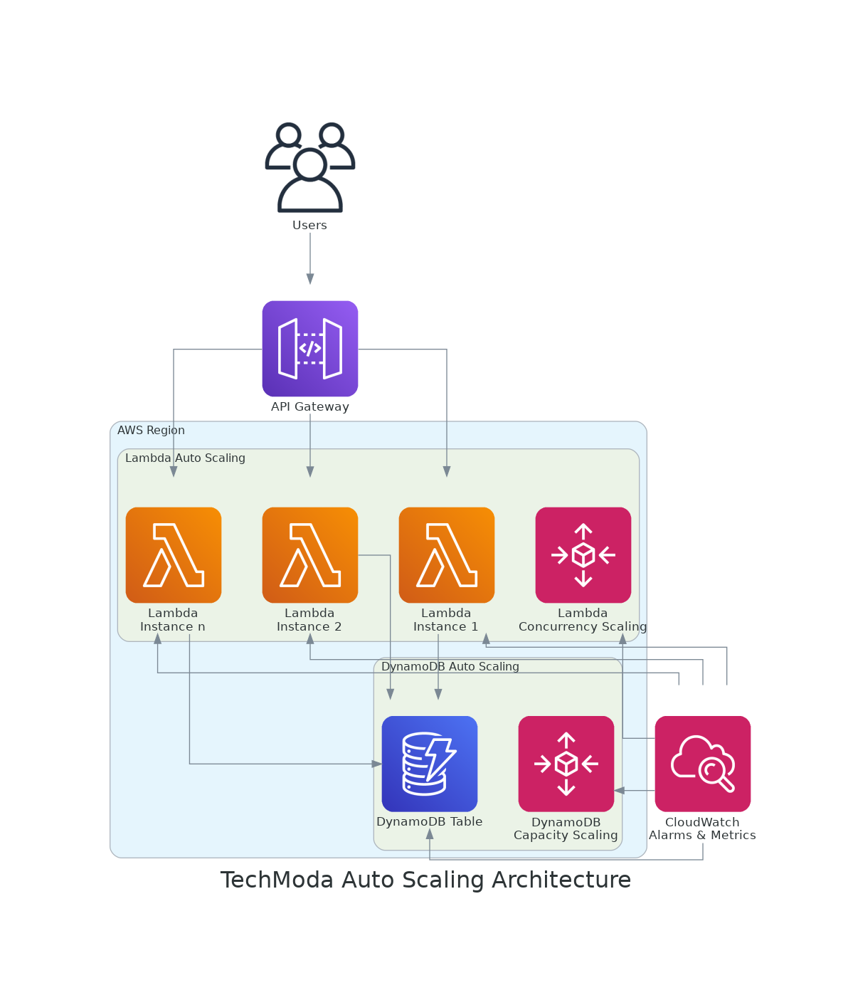

# Laboratorio 2: Implementación de Auto Escalado

## Descripción General

En este laboratorio, configurarás el auto escalado para la API serverless de productos de TechModa para manejar patrones de tráfico variables. Aprenderás cómo optimizar el rendimiento y la eficiencia de costos de las funciones Lambda y DynamoDB, asegurando que el sistema pueda manejar picos de tráfico durante eventos promocionales.

**Duración**: Aproximadamente 75 minutos

**Objetivos**:
- Configurar ajustes de concurrencia para Lambda
- Configurar capacidad bajo demanda para DynamoDB
- Implementar auto escalado de DynamoDB con capacidad aprovisionada
- Probar el comportamiento de auto escalado bajo carga
- Monitorear y analizar métricas de escalado

## Contexto Empresarial

TechModa regularmente realiza ventas flash y participa en eventos de moda que pueden hacer que el tráfico aumente de 500-1000% en cuestión de minutos. Durante un evento promocional reciente, su API de productos experimentó limitaciones y alta latencia debido a los límites de concurrencia de Lambda y restricciones de rendimiento de DynamoDB.

En este laboratorio, implementarás auto escalado para garantizar que la API de TechModa pueda manejar suavemente estos patrones de tráfico sin degradación del servicio.

## Arquitectura



La arquitectura incluirá:
- Funciones Lambda con concurrencia reservada
- DynamoDB con políticas de auto escalado
- Alarmas de CloudWatch para monitorear eventos de escalado

## Paso 1: Configurar Concurrencia de Lambda

Comienza configurando ajustes de concurrencia apropiados para tus funciones Lambda:

1. Revisa la configuración actual de concurrencia de Lambda:

```bash
aws lambda get-function-concurrency --function-name <nombre-de-función>
```

2. Actualiza el archivo `template.yaml` para configurar concurrencia reservada para funciones críticas:

```yaml
Resources:
  GetProductsFunction:
    Type: AWS::Serverless::Function
    Properties:
      Handler: src/getProducts.handler
      Runtime: nodejs14.x
      ReservedConcurrentExecutions: 100  # Reserva 100 ejecuciones concurrentes
      Events:
        GetProducts:
          Type: Api
          Properties:
            Path: /products
            Method: get
```

3. Para otras funciones, configura concurrencia aprovisionada para asegurar tiempos de respuesta rápidos:

```yaml
Resources:
  CreateProductFunction:
    Type: AWS::Serverless::Function
    Properties:
      Handler: src/createProduct.handler
      Runtime: nodejs14.x
      ProvisionedConcurrencyConfig:
        ProvisionedConcurrentExecutions: 10
      Events:
        CreateProduct:
          Type: Api
          Properties:
            Path: /products
            Method: post
```

## Paso 2: Configurar Auto Escalado de DynamoDB

A continuación, configura DynamoDB para escalar automáticamente basado en la demanda:

1. Actualiza el archivo `template.yaml` para configurar DynamoDB con capacidad aprovisionada y auto escalado:

```yaml
Resources:
  ProductsTable:
    Type: AWS::DynamoDB::Table
    Properties:
      TableName: !Sub ${AWS::StackName}-products
      BillingMode: PROVISIONED
      ProvisionedThroughput:
        ReadCapacityUnits: 5
        WriteCapacityUnits: 5
      AttributeDefinitions:
        - AttributeName: id
          AttributeType: S
      KeySchema:
        - AttributeName: id
          KeyType: HASH
      PointInTimeRecoverySpecification:
        PointInTimeRecoveryEnabled: true
      
  ProductsTableReadScalingPolicy:
    Type: AWS::ApplicationAutoScaling::ScalingPolicy
    Properties:
      PolicyName: ReadAutoScalingPolicy
      PolicyType: TargetTrackingScaling
      ScalingTargetId: !Ref ProductsTableReadScalingTarget
      TargetTrackingScalingPolicyConfiguration:
        TargetValue: 70.0
        PredefinedMetricSpecification:
          PredefinedMetricType: DynamoDBReadCapacityUtilization
          
  ProductsTableReadScalingTarget:
    Type: AWS::ApplicationAutoScaling::ScalableTarget
    Properties:
      MaxCapacity: 100
      MinCapacity: 5
      ResourceId: !Sub table/${ProductsTable}
      ScalableDimension: dynamodb:table:ReadCapacityUnits
      ServiceNamespace: dynamodb
      RoleARN: !GetAtt ScalingRole.Arn
      
  # Configuración similar para la capacidad de escritura
  
  ScalingRole:
    Type: AWS::IAM::Role
    Properties:
      AssumeRolePolicyDocument:
        Version: "2012-10-17"
        Statement:
          - Effect: Allow
            Principal:
              Service: application-autoscaling.amazonaws.com
            Action: "sts:AssumeRole"
      ManagedPolicyArns:
        - "arn:aws:iam::aws:policy/service-role/AmazonDynamoDBFullAccess"
```

2. Alternativamente, para mayor simplicidad, puedes usar el modo de capacidad bajo demanda:

```yaml
Resources:
  ProductsTable:
    Type: AWS::DynamoDB::Table
    Properties:
      TableName: !Sub ${AWS::StackName}-products
      BillingMode: PAY_PER_REQUEST
      AttributeDefinitions:
        - AttributeName: id
          AttributeType: S
      KeySchema:
        - AttributeName: id
          KeyType: HASH
      PointInTimeRecoverySpecification:
        PointInTimeRecoveryEnabled: true
```

3. Despliega la configuración actualizada:

```bash
sam build
sam deploy
```

## Paso 3: Crear Alarmas de CloudWatch para Eventos de Escalado

Configura alarmas de CloudWatch para monitorear eventos de escalado:

1. Añade la siguiente alarma de CloudWatch a tu archivo `template.yaml`:

```yaml
Resources:
  DynamoDBThrottleEventsAlarm:
    Type: AWS::CloudWatch::Alarm
    Properties:
      AlarmName: !Sub ${AWS::StackName}-DynamoDBThrottleEvents
      AlarmDescription: Alarma cuando las solicitudes de DynamoDB son limitadas
      MetricName: ReadThrottleEvents
      Namespace: AWS/DynamoDB
      Statistic: Sum
      Period: 60
      EvaluationPeriods: 1
      Threshold: 1
      ComparisonOperator: GreaterThanOrEqualToThreshold
      Dimensions:
        - Name: TableName
          Value: !Ref ProductsTable
```

## Paso 4: Probar el Comportamiento de Auto Escalado

Ahora vamos a probar cómo responde el sistema a un aumento de carga:

1. Crea un script de prueba de carga que simule picos de tráfico:

```bash
#!/bin/bash
API_URL="<url-de-tu-api>"

# Función para hacer solicitudes en paralelo
hacer_solicitudes() {
  local solicitudes_paralelas=$1
  
  for i in $(seq 1 $solicitudes_paralelas); do
    curl -s "$API_URL/products" > /dev/null &
  done
  wait
}

# Comenzar con tráfico bajo
echo "Comenzando con tráfico bajo (5 RPS)..."
for i in $(seq 1 30); do
  hacer_solicitudes 5
  sleep 1
done

# Tráfico medio
echo "Aumentando a tráfico medio (20 RPS)..."
for i in $(seq 1 30); do
  hacer_solicitudes 20
  sleep 1
done

# Pico de tráfico alto
echo "Simulando pico de tráfico (100 RPS)..."
for i in $(seq 1 60); do
  hacer_solicitudes 100
  sleep 1
done

# Enfriamiento
echo "Volviendo a tráfico normal..."
for i in $(seq 1 30); do
  hacer_solicitudes 5
  sleep 1
done
```

2. Ejecuta el script de prueba de carga y monitorea lo siguiente en la Consola de AWS:
   - Métricas de DynamoDB en CloudWatch
   - Concurrencia de Lambda
   - Solicitudes y latencia de API Gateway
   - Cualquier evento de limitación

## Paso 5: Analizar y Optimizar

Basado en los resultados de las pruebas, optimiza tu configuración de auto escalado:

1. Revisa las métricas de CloudWatch para identificar cualquier cuello de botella
2. Ajusta la configuración de concurrencia aprovisionada si es necesario
3. Afina los parámetros de auto escalado de DynamoDB basado en el comportamiento de escalado observado
4. Documenta tus hallazgos y recomendaciones

## Conclusión

Al completar este laboratorio, has implementado auto escalado para la API serverless de productos de TechModa, asegurando que pueda manejar patrones de tráfico variables, incluyendo picos repentinos durante eventos promocionales. Esta configuración ayuda a mantener el rendimiento y la disponibilidad mientras optimiza los costos durante períodos de menor tráfico.

En el próximo laboratorio, aprenderás a implementar estrategias de recuperación ante desastres para proteger contra interrupciones regionales y garantizar la continuidad del negocio.

## Recursos Adicionales

- [Escalado y Rendimiento de Lambda](https://docs.aws.amazon.com/lambda/latest/dg/lambda-concurrency.html)
- [Auto Escalado de DynamoDB](https://docs.aws.amazon.com/amazondynamodb/latest/developerguide/AutoScaling.html)
- [Marco AWS Well-Architected - Pilar de Eficiencia de Rendimiento](https://docs.aws.amazon.com/wellarchitected/latest/performance-efficiency-pillar/welcome.html)