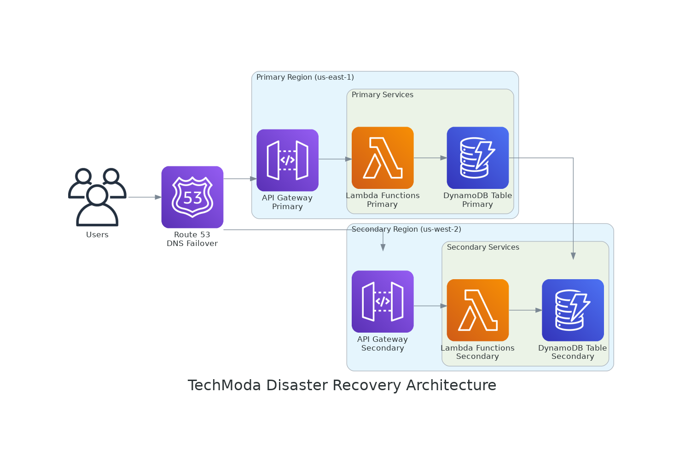

# Laboratorio 3: Estrategias de Recuperación ante Desastres

## Descripción General

En este laboratorio, implementarás estrategias de recuperación ante desastres para la API serverless de productos de TechModa para garantizar la continuidad del negocio en caso de una interrupción regional de AWS. Explorarás diferentes enfoques de DR e implementarás una solución que cumpla con los objetivos de tiempo y punto de recuperación de TechModa.

**Duración**: Aproximadamente 90 minutos

**Objetivos**:
- Comprender diferentes estrategias de recuperación ante desastres (respaldo-restauración, luz piloto, espera activa, multi-sitio)
- Implementar replicación entre regiones para DynamoDB
- Configurar un despliegue de API entre regiones
- Implementar mecanismos de conmutación por error
- Probar procedimientos de recuperación ante desastres
- Documentar procesos y procedimientos de recuperación

## Contexto Empresarial

TechModa experimentó una interrupción significativa del negocio durante una caída regional de AWS de 3 horas el trimestre pasado. Sin una estrategia de recuperación entre regiones implementada, su plataforma de comercio electrónico estuvo completamente indisponible, resultando en aproximadamente $350,000 en ventas perdidas y daño a la confianza del cliente.

El CTO ha ordenado implementar una solución de recuperación ante desastres con:
- Objetivo de Punto de Recuperación (RPO) de 15 minutos o menos
- Objetivo de Tiempo de Recuperación (RTO) de 30 minutos o menos

## Arquitectura



*Mostrando las regiones primaria y secundaria con conmutación por error DNS de Route 53 y replicación de DynamoDB*

La arquitectura incluirá:
- Despliegue en región primaria (ej., us-east-1)
- Despliegue en región secundaria (ej., us-west-2)
- Tablas globales de DynamoDB para replicación entre regiones
- Route 53 para conmutación por error de DNS

## Paso 1: Configurar Tablas Globales de DynamoDB

Comienza configurando tablas globales de DynamoDB para replicar datos entre regiones:

1. Actualiza el archivo `template.yaml` para habilitar flujos de DynamoDB, que son requeridos para tablas globales:

```yaml
Resources:
  ProductsTable:
    Type: AWS::DynamoDB::Table
    Properties:
      TableName: !Sub ${AWS::StackName}-products
      BillingMode: PAY_PER_REQUEST
      AttributeDefinitions:
        - AttributeName: id
          AttributeType: S
      KeySchema:
        - AttributeName: id
          KeyType: HASH
      StreamSpecification:
        StreamViewType: NEW_AND_OLD_IMAGES
      PointInTimeRecoverySpecification:
        PointInTimeRecoveryEnabled: true
```

2. Despliega la tabla actualizada en tu región primaria:

```bash
sam build
sam deploy --stack-name techmoda-api-primary --region us-east-1
```

3. Crea una tabla global utilizando la AWS CLI:

```bash
aws dynamodb create-global-table \
  --global-table-name techmoda-api-primary-products \
  --replication-group RegionName=us-east-1 RegionName=us-west-2 \
  --region us-east-1
```

## Paso 2: Desplegar Pila de API en Región Secundaria

Ahora, despliega toda la pila de API en una región secundaria:

1. Despliega la plantilla SAM en la región secundaria:

```bash
sam build
sam deploy --stack-name techmoda-api-secondary --region us-west-2
```

2. Verifica que ambos despliegues estén funcionando correctamente:

```bash
# Probar región primaria
curl https://<id-api-primaria>.execute-api.us-east-1.amazonaws.com/Prod/products

# Probar región secundaria
curl https://<id-api-secundaria>.execute-api.us-west-2.amazonaws.com/Prod/products
```

## Paso 3: Configurar Conmutación por Error de DNS con Route 53

Configura Route 53 para conmutación por error de DNS entre regiones:

1. Crea una verificación de salud de Route 53 para la API de la región primaria:

```bash
aws route53 create-health-check \
  --caller-reference $(date +%s) \
  --health-check-config "{\"Type\":\"HTTPS\",\"FullyQualifiedDomainName\":\"<id-api-primaria>.execute-api.us-east-1.amazonaws.com\",\"Port\":443,\"ResourcePath\":\"/Prod/health\",\"RequestInterval\":30,\"FailureThreshold\":3}"
```

2. Crea una zona alojada de Route 53 (si aún no tienes una):

```bash
aws route53 create-hosted-zone \
  --name api.techmoda-example.com \
  --caller-reference $(date +%s)
```

3. Configura registros de conmutación por error de DNS:

```bash
aws route53 change-resource-record-sets \
  --hosted-zone-id <id-de-tu-zona-alojada> \
  --change-batch '{
    "Changes": [
      {
        "Action": "CREATE",
        "ResourceRecordSet": {
          "Name": "api.techmoda-example.com",
          "Type": "A",
          "SetIdentifier": "primary",
          "Failover": "PRIMARY",
          "AliasTarget": {
            "HostedZoneId": "Z2FDTNDATAQYW2",
            "DNSName": "<id-api-primaria>.execute-api.us-east-1.amazonaws.com",
            "EvaluateTargetHealth": true
          },
          "HealthCheckId": "<id-de-tu-verificacion-de-salud>"
        }
      },
      {
        "Action": "CREATE",
        "ResourceRecordSet": {
          "Name": "api.techmoda-example.com",
          "Type": "A",
          "SetIdentifier": "secondary",
          "Failover": "SECONDARY",
          "AliasTarget": {
            "HostedZoneId": "Z2FDTNDATAQYW2",
            "DNSName": "<id-api-secundaria>.execute-api.us-west-2.amazonaws.com",
            "EvaluateTargetHealth": true
          }
        }
      }
    ]
  }'
```

## Paso 4: Implementar un Punto de Verificación de Salud

Añade un punto de verificación de salud a tu API para que Route 53 lo monitoree:

1. Crea una nueva función Lambda para la verificación de salud:

```javascript
// src/healthCheck.js
exports.handler = async (event) => {
  return {
    statusCode: 200,
    headers: {
      'Content-Type': 'application/json',
      'Access-Control-Allow-Origin': '*'
    },
    body: JSON.stringify({ status: 'healthy' })
  };
};
```

2. Actualiza el archivo `template.yaml` para añadir el punto de verificación de salud:

```yaml
Resources:
  HealthCheckFunction:
    Type: AWS::Serverless::Function
    Properties:
      Handler: src/healthCheck.handler
      Runtime: nodejs14.x
      Events:
        HealthCheck:
          Type: Api
          Properties:
            Path: /health
            Method: get
```

3. Despliega las actualizaciones en ambas regiones:

```bash
sam build
sam deploy --stack-name techmoda-api-primary --region us-east-1
sam deploy --stack-name techmoda-api-secondary --region us-west-2
```

## Paso 5: Probar Recuperación ante Desastres

Ahora, probemos las capacidades de recuperación ante desastres:

1. Crea un script para monitorear continuamente ambas regiones:

```bash
#!/bin/bash
PRIMARY_URL="https://<id-api-primaria>.execute-api.us-east-1.amazonaws.com/Prod/health"
SECONDARY_URL="https://<id-api-secundaria>.execute-api.us-west-2.amazonaws.com/Prod/health"
CUSTOM_DOMAIN="https://api.techmoda-example.com/Prod/health"

while true; do
  echo "$(date) - Probando región primaria..."
  curl -s $PRIMARY_URL
  echo -e "\n"
  
  echo "$(date) - Probando región secundaria..."
  curl -s $SECONDARY_URL
  echo -e "\n"
  
  echo "$(date) - Probando dominio personalizado (debería conmutar por error)..."
  curl -s $CUSTOM_DOMAIN
  echo -e "\n\n"
  
  sleep 10
done
```

2. Simula una interrupción regional mediante:
   - Deshabilitando la etapa de API Gateway de la región primaria
   - Modificando la función Lambda de verificación de salud para devolver un estado de fallo en la región primaria

3. Monitorea el comportamiento de conmutación por error:
   - ¿Cuánto tiempo tarda Route 53 en detectar el fallo?
   - ¿El tráfico se enruta correctamente a la región secundaria?
   - ¿Se mantiene la consistencia de datos entre regiones?

## Paso 6: Documentar Procedimientos de Recuperación ante Desastres

Crea un manual completo de recuperación ante desastres:

1. Documenta los pasos para iniciar manualmente la conmutación por error
2. Crea procedimientos para validar la salud de la región secundaria
3. Describe los pasos para volver a la región primaria una vez que esté disponible
4. Incluye información de contacto de las partes interesadas clave
5. Documenta las mediciones de RPO y RTO de tus pruebas

## Conclusión

Al completar este laboratorio, has implementado una estrategia de recuperación ante desastres entre regiones para la API serverless de productos de TechModa que cumple con sus requisitos de RPO y RTO. Esta configuración garantiza la continuidad del negocio incluso en el caso de una interrupción regional completa.

En el próximo laboratorio, aprenderás a implementar monitorización exhaustiva con CloudWatch para detectar y responder a problemas antes de que afecten a los clientes.

## Recursos Adicionales

- [Tablas Globales de DynamoDB](https://docs.aws.amazon.com/amazondynamodb/latest/developerguide/GlobalTables.html)
- [Conmutación por Error de DNS de Route 53](https://docs.aws.amazon.com/Route53/latest/DeveloperGuide/dns-failover.html)
- [Marco AWS Well-Architected - Pilar de Fiabilidad](https://docs.aws.amazon.com/wellarchitected/latest/reliability-pillar/welcome.html)
- [Estrategias de Recuperación ante Desastres en AWS](https://docs.aws.amazon.com/whitepapers/latest/disaster-recovery-workloads-on-aws/disaster-recovery-options-in-the-cloud.html)