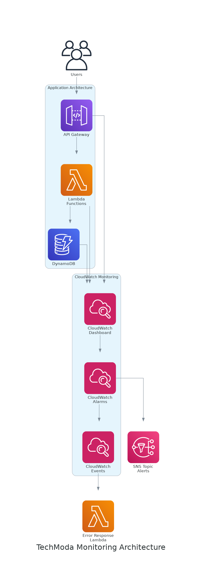

# Laboratorio 4: Monitorización con CloudWatch

## Descripción General

En este laboratorio, implementarás monitorización exhaustiva para la API serverless de productos de TechModa utilizando Amazon CloudWatch. Configurarás métricas, alarmas, paneles de control y respuestas automatizadas para asegurar que cualquier problema potencial sea detectado y abordado antes de que afecte a los clientes.

**Duración**: Aproximadamente 90 minutos

**Objetivos**:
- Configurar métricas detalladas de CloudWatch para Lambda, API Gateway y DynamoDB
- Crear métricas personalizadas para indicadores relevantes para el negocio
- Configurar alarmas de CloudWatch con umbrales apropiados
- Construir un panel de control exhaustivo en CloudWatch
- Implementar respuestas automatizadas con CloudWatch Events y Lambda
- Crear un sistema de notificación para alertas críticas

## Contexto Empresarial

TechModa ha experimentado varios problemas de rendimiento con su API de productos que no fueron detectados hasta que los clientes reportaron problemas. En un caso, un aumento gradual en la latencia de la API pasó desapercibido durante varias horas, resultando en carritos de compra abandonados y ventas perdidas.

El CTO quiere implementar monitorización proactiva que pueda:
- Detectar problemas antes de que afecten a los clientes
- Proporcionar visibilidad en tiempo real del rendimiento del sistema
- Responder automáticamente a problemas comunes
- Alertar al equipo de operaciones sobre problemas críticos

## Arquitectura



*Mostrando la configuración completa de monitorización con paneles de CloudWatch, alarmas, eventos y respuestas automatizadas*

La arquitectura incluirá:
- Métricas y alarmas de CloudWatch
- Panel de control personalizado de CloudWatch
- Reglas de CloudWatch Events
- Temas SNS para notificaciones
- Funciones Lambda para respuestas automatizadas

## Paso 1: Configurar Métricas Mejoradas de CloudWatch

Comienza habilitando métricas detalladas de CloudWatch para tus funciones Lambda:

1. Actualiza el archivo `template.yaml` para habilitar monitorización detallada:

```yaml
Globals:
  Function:
    Tracing: Active  # Habilita el rastreo con X-Ray
```

2. Actualiza configuraciones de funciones individuales:

```yaml
Resources:
  GetProductsFunction:
    Type: AWS::Serverless::Function
    Properties:
      Handler: src/getProducts.handler
      Runtime: nodejs14.x
      Tracing: Active
      # Añadir configuración adicional de monitorización
      Environment:
        Variables:
          LOG_LEVEL: INFO
```

3. Despliega la configuración actualizada:

```bash
sam build
sam deploy
```

## Paso 2: Crear Métricas Personalizadas

A continuación, modifica tus funciones Lambda para publicar métricas personalizadas:

1. Actualiza el código de tu función Lambda para publicar métricas personalizadas:

```javascript
// src/getProducts.js
const AWS = require('aws-sdk');
const cloudwatch = new AWS.CloudWatch();

exports.handler = async (event) => {
  const startTime = new Date().getTime();
  
  try {
    // Código existente para obtener productos
    const dynamoDB = new AWS.DynamoDB.DocumentClient();
    const result = await dynamoDB.scan({ TableName: process.env.PRODUCTS_TABLE }).promise();
    
    // Calcular tiempo de ejecución
    const executionTime = new Date().getTime() - startTime;
    
    // Publicar métricas personalizadas
    await cloudwatch.putMetricData({
      Namespace: 'TechModa/ProductAPI',
      MetricData: [
        {
          MetricName: 'ProductsReturned',
          Value: result.Items.length,
          Unit: 'Count'
        },
        {
          MetricName: 'ExecutionTime',
          Value: executionTime,
          Unit: 'Milliseconds'
        }
      ]
    }).promise();
    
    return {
      statusCode: 200,
      headers: {
        'Content-Type': 'application/json',
        'Access-Control-Allow-Origin': '*'
      },
      body: JSON.stringify(result.Items)
    };
  } catch (error) {
    // Publicar métrica de error
    await cloudwatch.putMetricData({
      Namespace: 'TechModa/ProductAPI',
      MetricData: [
        {
          MetricName: 'Errors',
          Value: 1,
          Unit: 'Count'
        }
      ]
    }).promise();
    
    return {
      statusCode: 500,
      headers: {
        'Content-Type': 'application/json',
        'Access-Control-Allow-Origin': '*'
      },
      body: JSON.stringify({ error: 'Error al obtener productos' })
    };
  }
};
```

2. Actualiza el rol IAM para permitir la publicación de métricas:

```yaml
Resources:
  GetProductsFunctionRole:
    Type: AWS::IAM::Role
    Properties:
      AssumeRolePolicyDocument:
        Version: '2012-10-17'
        Statement:
          - Effect: Allow
            Principal:
              Service: lambda.amazonaws.com
            Action: 'sts:AssumeRole'
      ManagedPolicyArns:
        - 'arn:aws:iam::aws:policy/service-role/AWSLambdaBasicExecutionRole'
      Policies:
        - PolicyName: DynamoDBAccess
          PolicyDocument:
            Version: '2012-10-17'
            Statement:
              - Effect: Allow
                Action:
                  - 'dynamodb:Scan'
                Resource: !GetAtt ProductsTable.Arn
        - PolicyName: CloudWatchMetrics
          PolicyDocument:
            Version: '2012-10-17'
            Statement:
              - Effect: Allow
                Action:
                  - 'cloudwatch:PutMetricData'
                Resource: '*'
```

## Paso 3: Configurar Alarmas de CloudWatch

Crea alarmas de CloudWatch para alertar sobre métricas críticas:

1. Añade las siguientes alarmas a tu archivo `template.yaml`:

```yaml
Resources:
  APILatencyAlarm:
    Type: AWS::CloudWatch::Alarm
    Properties:
      AlarmName: !Sub ${AWS::StackName}-APILatencyAlarm
      AlarmDescription: Alarma cuando la latencia de la API excede el umbral
      Namespace: AWS/ApiGateway
      MetricName: Latency
      Dimensions:
        - Name: ApiName
          Value: !Ref ServerlessRestApi
      Statistic: Average
      Period: 60
      EvaluationPeriods: 5
      Threshold: 500
      ComparisonOperator: GreaterThanThreshold
      AlarmActions:
        - !Ref AlertTopic
        
  API5xxErrorsAlarm:
    Type: AWS::CloudWatch::Alarm
    Properties:
      AlarmName: !Sub ${AWS::StackName}-API5xxErrorsAlarm
      AlarmDescription: Alarma cuando la API devuelve errores 5xx
      Namespace: AWS/ApiGateway
      MetricName: 5XXError
      Dimensions:
        - Name: ApiName
          Value: !Ref ServerlessRestApi
      Statistic: Sum
      Period: 60
      EvaluationPeriods: 1
      Threshold: 1
      ComparisonOperator: GreaterThanOrEqualToThreshold
      AlarmActions:
        - !Ref AlertTopic
        - !Ref ErrorResponseFunction.Arn
        
  DynamoDBThrottlingAlarm:
    Type: AWS::CloudWatch::Alarm
    Properties:
      AlarmName: !Sub ${AWS::StackName}-DynamoDBThrottlingAlarm
      AlarmDescription: Alarma cuando DynamoDB está limitando solicitudes
      Namespace: AWS/DynamoDB
      MetricName: ThrottledRequests
      Dimensions:
        - Name: TableName
          Value: !Ref ProductsTable
      Statistic: Sum
      Period: 60
      EvaluationPeriods: 1
      Threshold: 1
      ComparisonOperator: GreaterThanOrEqualToThreshold
      AlarmActions:
        - !Ref AlertTopic
        
  AlertTopic:
    Type: AWS::SNS::Topic
    Properties:
      TopicName: !Sub ${AWS::StackName}-Alerts
      
  AlertTopicSubscription:
    Type: AWS::SNS::Subscription
    Properties:
      TopicArn: !Ref AlertTopic
      Protocol: email
      Endpoint: ops-team@techmoda-example.com
```

## Paso 4: Crear una Respuesta Automatizada

Implementa una respuesta automatizada para manejar errores de API:

1. Crea una nueva función Lambda para respuesta automatizada a errores:

```javascript
// src/errorResponse.js
exports.handler = async (event) => {
  console.log('Alarma recibida:', JSON.stringify(event, null, 2));
  
  // Analizar los datos de la alarma
  const message = JSON.parse(event.Records[0].Sns.Message);
  
  // Tomar acción automatizada basada en la alarma
  if (message.AlarmName.includes('API5xxErrorsAlarm')) {
    console.log('Detectados errores 5xx, iniciando respuesta automatizada');
    
    // Aquí implementarías tu respuesta automatizada
    // Ejemplos:
    // - Reiniciar la etapa de API
    // - Escalar recursos
    // - Limpiar cachés
    // - Notificar a miembros específicos del equipo
  }
  
  return {
    statusCode: 200,
    body: JSON.stringify({ message: 'Respuesta automatizada iniciada' })
  };
};
```

2. Añade la función a tu archivo `template.yaml`:

```yaml
Resources:
  ErrorResponseFunction:
    Type: AWS::Serverless::Function
    Properties:
      Handler: src/errorResponse.handler
      Runtime: nodejs14.x
      Events:
        SNSEvent:
          Type: SNS
          Properties:
            Topic: !Ref AlertTopic
```

## Paso 5: Crear un Panel de Control en CloudWatch

Construye un panel de control exhaustivo para monitorear tu API serverless:

1. Añade un panel de control de CloudWatch a tu archivo `template.yaml`:

```yaml
Resources:
  ProductAPIDashboard:
    Type: AWS::CloudWatch::Dashboard
    Properties:
      DashboardName: !Sub ${AWS::StackName}-ProductAPI
      DashboardBody: !Sub |
        {
          "widgets": [
            {
              "type": "metric",
              "x": 0,
              "y": 0,
              "width": 12,
              "height": 6,
              "properties": {
                "metrics": [
                  [ "AWS/ApiGateway", "Latency", "ApiName", "${ServerlessRestApi}", { "stat": "Average" } ],
                  [ ".", "IntegrationLatency", ".", ".", { "stat": "Average" } ]
                ],
                "view": "timeSeries",
                "stacked": false,
                "region": "${AWS::Region}",
                "title": "Latencia de API",
                "period": 60
              }
            },
            {
              "type": "metric",
              "x": 12,
              "y": 0,
              "width": 12,
              "height": 6,
              "properties": {
                "metrics": [
                  [ "AWS/ApiGateway", "Count", "ApiName", "${ServerlessRestApi}", { "stat": "Sum" } ],
                  [ ".", "4XXError", ".", ".", { "stat": "Sum" } ],
                  [ ".", "5XXError", ".", ".", { "stat": "Sum" } ]
                ],
                "view": "timeSeries",
                "stacked": false,
                "region": "${AWS::Region}",
                "title": "Solicitudes y Errores de API",
                "period": 60
              }
            },
            {
              "type": "metric",
              "x": 0,
              "y": 6,
              "width": 12,
              "height": 6,
              "properties": {
                "metrics": [
                  [ "AWS/Lambda", "Invocations", "FunctionName", "${GetProductsFunction}", { "stat": "Sum" } ],
                  [ ".", ".", ".", "${CreateProductFunction}", { "stat": "Sum" } ],
                  [ ".", ".", ".", "${UpdateProductFunction}", { "stat": "Sum" } ],
                  [ ".", ".", ".", "${DeleteProductFunction}", { "stat": "Sum" } ]
                ],
                "view": "timeSeries",
                "stacked": false,
                "region": "${AWS::Region}",
                "title": "Invocaciones Lambda",
                "period": 60
              }
            },
            {
              "type": "metric",
              "x": 12,
              "y": 6,
              "width": 12,
              "height": 6,
              "properties": {
                "metrics": [
                  [ "AWS/Lambda", "Duration", "FunctionName", "${GetProductsFunction}", { "stat": "Average" } ],
                  [ ".", ".", ".", "${CreateProductFunction}", { "stat": "Average" } ],
                  [ ".", ".", ".", "${UpdateProductFunction}", { "stat": "Average" } ],
                  [ ".", ".", ".", "${DeleteProductFunction}", { "stat": "Average" } ]
                ],
                "view": "timeSeries",
                "stacked": false,
                "region": "${AWS::Region}",
                "title": "Duración Lambda",
                "period": 60
              }
            },
            {
              "type": "metric",
              "x": 0,
              "y": 12,
              "width": 12,
              "height": 6,
              "properties": {
                "metrics": [
                  [ "AWS/DynamoDB", "ConsumedReadCapacityUnits", "TableName", "${ProductsTable}", { "stat": "Sum" } ],
                  [ ".", "ConsumedWriteCapacityUnits", ".", ".", { "stat": "Sum" } ]
                ],
                "view": "timeSeries",
                "stacked": false,
                "region": "${AWS::Region}",
                "title": "Consumo de Capacidad DynamoDB",
                "period": 60
              }
            },
            {
              "type": "metric",
              "x": 12,
              "y": 12,
              "width": 12,
              "height": 6,
              "properties": {
                "metrics": [
                  [ "TechModa/ProductAPI", "ProductsReturned", { "stat": "Average" } ],
                  [ ".", "ExecutionTime", { "stat": "Average" } ],
                  [ ".", "Errors", { "stat": "Sum" } ]
                ],
                "view": "timeSeries",
                "stacked": false,
                "region": "${AWS::Region}",
                "title": "Métricas Personalizadas",
                "period": 60
              }
            }
          ]
        }
```

## Paso 6: Probar el Sistema de Monitorización

Ahora, vamos a probar el sistema de monitorización:

1. Genera algo de tráfico a la API:

```bash
#!/bin/bash
API_URL="<url-de-tu-api>"

# Tráfico normal
for i in $(seq 1 50); do
  curl -s "$API_URL/products" > /dev/null
  sleep 1
done

# Generar algunos errores
for i in $(seq 1 5); do
  curl -s -X POST "$API_URL/products" -d '{"invalid": "data"}' > /dev/null
  sleep 1
done

# Tráfico pesado
for i in $(seq 1 20); do
  for j in $(seq 1 10); do
    curl -s "$API_URL/products" > /dev/null &
  done
  wait
  sleep 1
done
```

2. Monitorea el panel de control de CloudWatch para observar las métricas
3. Activa una alarma para probar el sistema de notificación y respuesta automatizada

## Conclusión

Al completar este laboratorio, has implementado monitorización exhaustiva para la API serverless de productos de TechModa, asegurando que los problemas potenciales puedan ser detectados y abordados antes de que afecten a los clientes. Este sistema de monitorización proporciona visibilidad en tiempo real del rendimiento del sistema y puede responder automáticamente a problemas comunes.

En el próximo laboratorio, implementarás un proyecto capstone que integrará todos los conceptos aprendidos en un sistema completo de alta disponibilidad y recuperación ante desastres.

## Recursos Adicionales

- [Métricas y Alarmas de CloudWatch](https://docs.aws.amazon.com/AmazonCloudWatch/latest/monitoring/working_with_metrics.html)
- [Paneles de Control de CloudWatch](https://docs.aws.amazon.com/AmazonCloudWatch/latest/monitoring/CloudWatch_Dashboards.html)
- [Monitorización de AWS Lambda](https://docs.aws.amazon.com/lambda/latest/dg/monitoring-functions.html)
- [Monitorización de DynamoDB](https://docs.aws.amazon.com/amazondynamodb/latest/developerguide/monitoring.html)