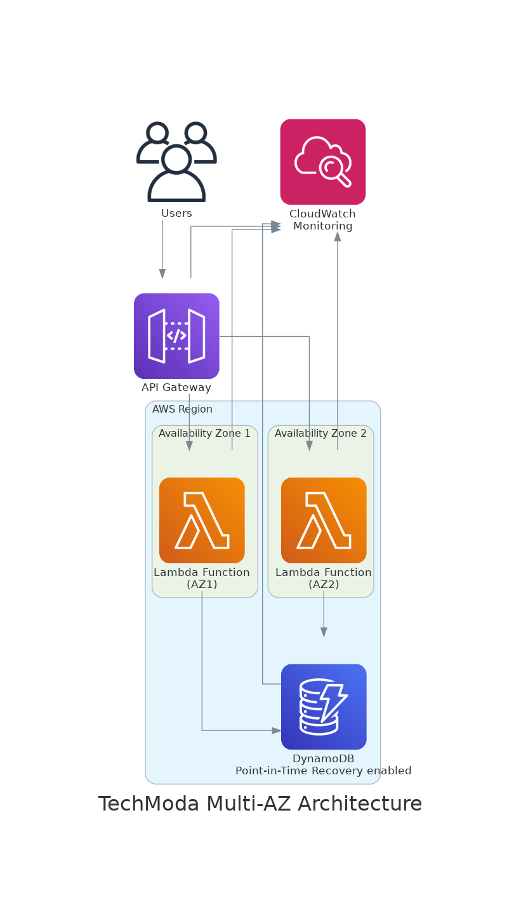

# Proyecto Capstone: Solución Integral de Alta Disponibilidad

## Descripción General

En este proyecto capstone, implementarás una solución integral de alta disponibilidad para la API de productos de TechModa, que integra todas las técnicas aprendidas en los laboratorios anteriores. Desarrollarás un sistema completo que proteja contra pérdidas de datos y garantice la continuidad del negocio frente a diversos escenarios de fallo.

**Duración**: Aproximadamente 120 minutos

**Objetivos**:
- Integrar arquitectura Multi-AZ con estrategias de auto-escalado
- Configurar recuperación ante desastres con replicación entre regiones
- Implementar monitorización exhaustiva con CloudWatch
- Configurar recuperación a un punto en el tiempo (PITR) para DynamoDB
- Desarrollar políticas de respaldo automático con AWS Backup
- Crear y probar procedimientos de restauración
- Desarrollar una política integral de disponibilidad y recuperación

## Contexto Empresarial

TechModa ha experimentado un crecimiento exponencial en el último trimestre, con expansión a nuevos mercados internacionales. La dirección ha establecido objetivos estrictos de disponibilidad y tiempo de recuperación:

- Disponibilidad del 99,99% para la API de productos
- Objetivo de punto de recuperación (RPO) de menos de 15 minutos
- Objetivo de tiempo de recuperación (RTO) de menos de 30 minutos
- Capacidad para manejar aumentos de tráfico de hasta 1000% durante eventos de moda
- Cumplimiento de normativas internacionales sobre protección de datos

El CTO ha solicitado una solución integral que combine todos los aspectos de alta disponibilidad y recuperación ante desastres en una única arquitectura robusta y resiliente.

## Arquitectura



*Arquitectura completa que integra Multi-AZ, Auto Escalado, Recuperación ante Desastres y Monitorización*

La arquitectura incluirá:
- Implementación Multi-AZ con DynamoDB configurado para alta disponibilidad
- Auto-escalado para Lambda y DynamoDB
- Replicación entre regiones para recuperación ante desastres
- Sistema de monitorización completo con alarmas y respuestas automatizadas
- Estrategia integral de respaldos con validación

## Fase 1: Configurar Infraestructura Multi-AZ con Auto-escalado

Comienza configurando una arquitectura Multi-AZ con capacidad de auto-escalado:

1. Actualiza el archivo `template.yaml` para integrar ambas funcionalidades:

```yaml
Resources:
  ProductsTable:
    Type: AWS::DynamoDB::Table
    Properties:
      TableName: !Sub ${AWS::StackName}-products
      BillingMode: PROVISIONED
      ProvisionedThroughput:
        ReadCapacityUnits: 5
        WriteCapacityUnits: 5
      AttributeDefinitions:
        - AttributeName: id
          AttributeType: S
      KeySchema:
        - AttributeName: id
          KeyType: HASH
      PointInTimeRecoverySpecification:
        PointInTimeRecoveryEnabled: true
      StreamSpecification:
        StreamViewType: NEW_AND_OLD_IMAGES
        
  # Configuración de Auto-escalado para DynamoDB
  ProductsTableReadScalingPolicy:
    Type: AWS::ApplicationAutoScaling::ScalingPolicy
    Properties:
      PolicyName: ReadAutoScalingPolicy
      PolicyType: TargetTrackingScaling
      ScalingTargetId: !Ref ProductsTableReadScalingTarget
      TargetTrackingScalingPolicyConfiguration:
        TargetValue: 70.0
        PredefinedMetricSpecification:
          PredefinedMetricType: DynamoDBReadCapacityUtilization
          
  ProductsTableReadScalingTarget:
    Type: AWS::ApplicationAutoScaling::ScalableTarget
    Properties:
      MaxCapacity: 100
      MinCapacity: 5
      ResourceId: !Sub table/${ProductsTable}
      ScalableDimension: dynamodb:table:ReadCapacityUnits
      ServiceNamespace: dynamodb
      RoleARN: !GetAtt ScalingRole.Arn
      
  # Configuración de capacidad reservada para Lambda
  GetProductsFunction:
    Type: AWS::Serverless::Function
    Properties:
      Handler: src/getProducts.handler
      Runtime: nodejs14.x
      ReservedConcurrentExecutions: 50
      Environment:
        Variables:
          PRODUCTS_TABLE: !Ref ProductsTable
      Events:
        GetProducts:
          Type: Api
          Properties:
            Path: /products
            Method: get
```

2. Despliega la configuración actualizada:

```bash
sam build
sam deploy
```

## Fase 2: Implementar Recuperación ante Desastres con Replicación entre Regiones

Ahora, configura la replicación entre regiones para DynamoDB y un sistema de conmutación por error:

1. Crea una tabla global de DynamoDB utilizando AWS CLI:

```bash
aws dynamodb create-global-table \
  --global-table-name techmoda-api-products \
  --replication-group RegionName=us-east-1 RegionName=us-west-2 \
  --region us-east-1
```

2. Configura el DNS con failover usando Route 53:

```yaml
Resources:
  HealthCheckPrimary:
    Type: AWS::Route53::HealthCheck
    Properties:
      HealthCheckConfig:
        Type: HTTPS
        FullyQualifiedDomainName: !Sub "${ServerlessRestApi}.execute-api.${AWS::Region}.amazonaws.com"
        ResourcePath: "/Prod/health"
        RequestInterval: 30
        FailureThreshold: 3
      
  ApiDnsRecordPrimary:
    Type: AWS::Route53::RecordSet
    Properties:
      HostedZoneId: !Ref HostedZoneId
      Name: !Sub "api.${DomainName}"
      Type: A
      SetIdentifier: "primary"
      Failover: "PRIMARY"
      AliasTarget:
        DNSName: !Sub "${ServerlessRestApi}.execute-api.${AWS::Region}.amazonaws.com"
        HostedZoneId: "Z2FDTNDATAQYW2" # ID de zona alojada para API Gateway
        EvaluateTargetHealth: true
      HealthCheckId: !Ref HealthCheckPrimary
```

## Fase 3: Configurar Monitorización Integral con CloudWatch

Implementa un sistema de monitorización completo:

1. Añade métricas personalizadas y un panel de control a tu `template.yaml`:

```yaml
Resources:
  ProductAPIMonitoringDashboard:
    Type: AWS::CloudWatch::Dashboard
    Properties:
      DashboardName: !Sub "${AWS::StackName}-monitoring"
      DashboardBody: !Sub |
        {
          "widgets": [
            {
              "type": "metric",
              "x": 0,
              "y": 0,
              "width": 12,
              "height": 6,
              "properties": {
                "metrics": [
                  [ "AWS/ApiGateway", "Latency", "ApiName", "${ServerlessRestApi}", { "stat": "Average" } ],
                  [ ".", "IntegrationLatency", ".", ".", { "stat": "Average" } ]
                ],
                "view": "timeSeries",
                "region": "${AWS::Region}",
                "title": "Latencia de API"
              }
            },
            {
              "type": "metric",
              "x": 12,
              "y": 0,
              "width": 12,
              "height": 6,
              "properties": {
                "metrics": [
                  [ "AWS/Lambda", "Invocations", "FunctionName", "${GetProductsFunction}" ],
                  [ ".", "Duration", ".", "." ],
                  [ ".", "Errors", ".", "." ]
                ],
                "view": "timeSeries",
                "region": "${AWS::Region}",
                "title": "Métricas de Lambda"
              }
            },
            {
              "type": "metric",
              "x": 0,
              "y": 6,
              "width": 12,
              "height": 6,
              "properties": {
                "metrics": [
                  [ "AWS/DynamoDB", "ConsumedReadCapacityUnits", "TableName", "${ProductsTable}" ],
                  [ ".", "ConsumedWriteCapacityUnits", ".", "." ]
                ],
                "view": "timeSeries",
                "region": "${AWS::Region}",
                "title": "Capacidad de DynamoDB"
              }
            }
          ]
        }
        
  # Alarmas críticas
  ApiLatencyAlarm:
    Type: AWS::CloudWatch::Alarm
    Properties:
      AlarmName: !Sub "${AWS::StackName}-api-latency"
      AlarmDescription: "Alarma cuando la latencia de la API excede el umbral"
      MetricName: "Latency"
      Namespace: "AWS/ApiGateway"
      Statistic: "Average"
      Period: 60
      EvaluationPeriods: 3
      Threshold: 500
      ComparisonOperator: "GreaterThanThreshold"
      AlarmActions:
        - !Ref AlertTopic
        
  AlertTopic:
    Type: AWS::SNS::Topic
    Properties:
      TopicName: !Sub "${AWS::StackName}-alerts"
```

2. Modifica las funciones Lambda para publicar métricas personalizadas:

```javascript
// Ejemplo para getProducts.js
const AWS = require('aws-sdk');
const cloudwatch = new AWS.CloudWatch();

exports.handler = async (event) => {
  const startTime = new Date().getTime();
  
  try {
    // Código existente
    
    // Publicar métricas personalizadas
    await cloudwatch.putMetricData({
      Namespace: 'TechModa/API',
      MetricData: [
        {
          MetricName: 'ProductListSize',
          Value: items.length,
          Unit: 'Count'
        },
        {
          MetricName: 'ResponseTime',
          Value: new Date().getTime() - startTime,
          Unit: 'Milliseconds'
        }
      ]
    }).promise();
    
    return {
      statusCode: 200,
      headers: {
        'Content-Type': 'application/json',
        'Access-Control-Allow-Origin': '*'
      },
      body: JSON.stringify(items)
    };
  } catch (error) {
    // Registrar errores como métrica
    await cloudwatch.putMetricData({
      Namespace: 'TechModa/API',
      MetricData: [
        {
          MetricName: 'Errors',
          Value: 1,
          Unit: 'Count'
        }
      ]
    }).promise();
    
    return {
      statusCode: 500,
      headers: {
        'Content-Type': 'application/json',
        'Access-Control-Allow-Origin': '*'
      },
      body: JSON.stringify({ error: 'Error al obtener productos' })
    };
  }
};
```

## Fase 4: Implementar Estrategia de Respaldo Integral

Configura una estrategia de respaldo completa:

1. Configura AWS Backup con políticas de retención:

```yaml
Resources:
  BackupVault:
    Type: AWS::Backup::BackupVault
    Properties:
      BackupVaultName: !Sub "${AWS::StackName}-vault"
      
  BackupPlan:
    Type: AWS::Backup::BackupPlan
    Properties:
      BackupPlan:
        BackupPlanName: !Sub "${AWS::StackName}-backup-plan"
        BackupPlanRule:
          - RuleName: "RespaldosDiarios"
            TargetBackupVault: !Ref BackupVault
            ScheduleExpression: "cron(0 1 * * ? *)"  # Diario a la 1:00 AM UTC
            StartWindowMinutes: 60
            CompletionWindowMinutes: 120
            Lifecycle:
              DeleteAfterDays: 30
            CopyActions:
              - DestinationBackupVaultArn: !Sub "arn:aws:backup:us-west-2:${AWS::AccountId}:backup-vault/${AWS::StackName}-vault-dr"
                Lifecycle:
                  DeleteAfterDays: 30
          - RuleName: "RespaldosSemanales"
            TargetBackupVault: !Ref BackupVault
            ScheduleExpression: "cron(0 0 ? * SUN *)"  # Domingo a medianoche UTC
            StartWindowMinutes: 120
            CompletionWindowMinutes: 240
            Lifecycle:
              DeleteAfterDays: 90
              MoveToColdStorageAfterDays: 30
```

2. Crea una función Lambda para la restauración de respaldos:

```javascript
// src/gestionRespaldos.js
const AWS = require('aws-sdk');
const backup = new AWS.Backup();
const dynamodb = new AWS.DynamoDB();

exports.handler = async (event) => {
  if (event.operacion === 'restaurar') {
    // Código para restaurar desde un backup o punto en el tiempo
    const params = {
      SourceTableName: process.env.PRODUCTS_TABLE,
      TargetTableName: `${process.env.PRODUCTS_TABLE}-restaurado-${Date.now()}`,
      RestoreDateTime: new Date(event.fechaHora).toISOString(),
      UseLatestRestorableTime: event.usarUltimoTiempoRestaurable || false
    };
    
    try {
      const resultado = await dynamodb.restoreTableToPointInTime(params).promise();
      return {
        statusCode: 200,
        body: JSON.stringify({
          mensaje: 'Restauración iniciada',
          detalles: resultado
        })
      };
    } catch (error) {
      return {
        statusCode: 500,
        body: JSON.stringify({
          mensaje: 'Error al iniciar la restauración',
          error: error.message
        })
      };
    }
  } else if (event.operacion === 'validar') {
    // Código para validar backups recientes
    try {
      const backupJobs = await backup.listBackupJobs({
        ResourceType: 'DynamoDB',
        ByResource: { TableName: process.env.PRODUCTS_TABLE }
      }).promise();
      
      // Verificar si hay backups recientes exitosos
      const backupsExitosos = backupJobs.BackupJobs.filter(job => 
        job.State === 'COMPLETED' && 
        new Date(job.CompletionDate) > new Date(Date.now() - 24 * 60 * 60 * 1000)
      );
      
      return {
        statusCode: 200,
        body: JSON.stringify({
          mensaje: 'Validación de respaldos completada',
          estadoValidacion: backupsExitosos.length > 0 ? 'EXITOSO' : 'FALLIDO',
          numeroRespaldos: backupsExitosos.length
        })
      };
    } catch (error) {
      return {
        statusCode: 500,
        body: JSON.stringify({
          mensaje: 'Error al validar respaldos',
          error: error.message
        })
      };
    }
  }
};
```

## Fase 5: Integrar Todo en un Pipeline de CI/CD

Finalmente, integra todas las configuraciones en un pipeline de CI/CD:

1. Crea un archivo `buildspec.yml` para AWS CodeBuild:

```yaml
version: 0.2

phases:
  install:
    runtime-versions:
      nodejs: 14
    commands:
      - npm install -g aws-sam-cli
      - npm install
  
  build:
    commands:
      - echo "Ejecutando pruebas unitarias"
      - npm test
      - echo "Construyendo aplicación SAM"
      - sam build
  
  post_build:
    commands:
      - echo "Realizando despliegue"
      - sam deploy --stack-name techmoda-api --no-confirm-changeset

artifacts:
  files:
    - template.yaml
    - packaged.yaml
    - README.md
```

2. Configura un pipeline en AWS CodePipeline:

```yaml
Resources:
  CodeBuildServiceRole:
    Type: AWS::IAM::Role
    Properties:
      AssumeRolePolicyDocument:
        Version: '2012-10-17'
        Statement:
          - Effect: Allow
            Principal:
              Service: codebuild.amazonaws.com
            Action: 'sts:AssumeRole'
      ManagedPolicyArns:
        - 'arn:aws:iam::aws:policy/AmazonS3FullAccess'
        - 'arn:aws:iam::aws:policy/AWSCloudFormationFullAccess'
        - 'arn:aws:iam::aws:policy/AWSLambdaFullAccess'
        
  ArtifactBucket:
    Type: AWS::S3::Bucket
    Properties:
      VersioningConfiguration:
        Status: Enabled
        
  CodeBuildProject:
    Type: AWS::CodeBuild::Project
    Properties:
      Name: !Sub "${AWS::StackName}-build"
      ServiceRole: !GetAtt CodeBuildServiceRole.Arn
      Artifacts:
        Type: CODEPIPELINE
      Environment:
        Type: LINUX_CONTAINER
        ComputeType: BUILD_GENERAL1_SMALL
        Image: aws/codebuild/amazonlinux2-x86_64-standard:3.0
      Source:
        Type: CODEPIPELINE
        BuildSpec: buildspec.yml
```

## Fase 6: Prueba Integral de Alta Disponibilidad

Ahora, prueba la solución completa para verificar que todos los componentes funcionan juntos:

1. Crea un script de prueba para simular diversos escenarios:

```bash
#!/bin/bash
API_URL="<tu-url-api>"

# Función para enviar solicitudes a la API
enviar_solicitudes() {
  local solicitudes_por_segundo=$1
  local duracion_segundos=$2
  
  echo "Enviando $solicitudes_por_segundo solicitudes por segundo durante $duracion_segundos segundos..."
  
  for i in $(seq 1 $duracion_segundos); do
    for j in $(seq 1 $solicitudes_por_segundo); do
      curl -s "$API_URL/products" > /dev/null &
    done
    sleep 1
  done
}

# Prueba 1: Tráfico normal
echo "Prueba 1: Tráfico normal (5 RPS durante 30 segundos)"
enviar_solicitudes 5 30

# Prueba 2: Aumento gradual de tráfico
echo "Prueba 2: Aumento gradual de tráfico"
enviar_solicitudes 10 30
enviar_solicitudes 20 30
enviar_solicitudes 50 30

# Prueba 3: Pico de tráfico
echo "Prueba 3: Pico de tráfico (100 RPS durante 60 segundos)"
enviar_solicitudes 100 60

# Prueba 4: Simular error
echo "Prueba 4: Simular error en la API"
for i in $(seq 1 10); do
  curl -s -X POST "$API_URL/products" -H "Content-Type: application/json" -d '{"datos":"invalidos"}' &
done

# Volver a tráfico normal
echo "Volviendo a tráfico normal..."
enviar_solicitudes 5 30
```

2. Monitoriza el comportamiento del sistema durante las pruebas:
   - Observa el panel de CloudWatch
   - Verifica si las alarmas se activan
   - Comprueba la escalabilidad de DynamoDB y Lambda
   - Verifica la creación de respaldos

## Fase 7: Documentación de la Arquitectura de Alta Disponibilidad

Finalmente, documenta la arquitectura completa:

```markdown
# Arquitectura de Alta Disponibilidad de TechModa

## Resumen
Este documento describe la arquitectura de alta disponibilidad implementada para la API de productos de TechModa, que garantiza una disponibilidad del 99,99% y tiempos de recuperación rápidos ante desastres.

## Componentes de Alta Disponibilidad

### Resiliencia Multi-AZ
- Implementación en múltiples zonas de disponibilidad
- DynamoDB con replicación automática entre AZs
- Lambda y API Gateway con distribución automática de carga

### Escalabilidad Automática
- Auto-escalado de DynamoDB basado en consumo de capacidad
- Configuración de concurrencia para funciones Lambda
- Métricas de uso para escalar dinámicamente

### Recuperación ante Desastres
- Tablas globales de DynamoDB con replicación multi-región
- Failover de DNS con Route 53
- RPO menor a 15 minutos y RTO menor a 30 minutos

### Monitorización y Alertas
- Panel de control centralizado en CloudWatch
- Alarmas configuradas para métricas críticas
- Respuestas automatizadas a incidentes

### Respaldo y Recuperación
- Respaldos diarios, semanales y mensuales
- Recuperación a punto en el tiempo (PITR)
- Validación automática de respaldos

## Flujos de Recuperación

### Escenario 1: Fallo en una Zona de Disponibilidad
1. AWS redirige automáticamente el tráfico a AZs disponibles
2. No se requiere intervención manual

### Escenario 2: Fallo Regional
1. Route 53 detecta el fallo y redirige el tráfico a la región secundaria
2. DynamoDB Global Tables garantiza que los datos estén sincronizados
3. Tiempo de recuperación estimado: <5 minutos

### Escenario 3: Corrupción de Datos
1. Ejecutar función de restauración a un punto en el tiempo anterior a la corrupción
2. Validar los datos restaurados
3. Actualizar la configuración para apuntar a la tabla restaurada
4. Tiempo de recuperación estimado: 20-30 minutos

## Responsabilidades del Equipo
- **Equipo de Desarrollo**: Mantener infraestructura como código
- **Equipo de Operaciones**: Monitorear alertas y responder a incidentes
- **Equipo de Seguridad**: Revisar configuraciones y controles de acceso
```

## Conclusión

Al completar este proyecto capstone, has implementado una solución integral de alta disponibilidad para la API de productos de TechModa, que combina arquitectura Multi-AZ, auto-escalado, recuperación ante desastres, monitorización y respaldo. Esta arquitectura robusta garantiza que la plataforma pueda mantener su operación incluso frente a diversos tipos de fallos e incidentes.

Has aplicado todos los conocimientos adquiridos en los laboratorios anteriores para crear un sistema resiliente que cumple con los estrictos requisitos empresariales de disponibilidad y tiempo de recuperación.

## Recursos Adicionales

- [AWS Well-Architected Framework - Pilar de Fiabilidad](https://docs.aws.amazon.com/wellarchitected/latest/reliability-pillar/welcome.html)
- [Implementación de Arquitecturas de Alta Disponibilidad en AWS](https://aws.amazon.com/blogs/architecture/implementing-high-availability-on-aws/)
- [Tablas Globales de DynamoDB](https://docs.aws.amazon.com/amazondynamodb/latest/developerguide/GlobalTables.html)
- [Automatización de Respaldo y Restauración con AWS Backup](https://docs.aws.amazon.com/aws-backup/latest/devguide/whatisbackup.html)
- [Estrategias de Recuperación ante Desastres en AWS](https://docs.aws.amazon.com/whitepapers/latest/disaster-recovery-workloads-on-aws/disaster-recovery-options-in-the-cloud.html)